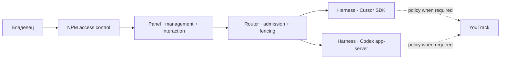

<div align="center">

# HomeLab Panel

**Единое рабочее место для управления AI-агентами и общения с ними через Harness.**

Cursor · Codex · Диалоги · Очередь · Управление выполнением

</div>

Развёрнутая alpha: <https://h1-cloud.ru/panel/>. Компонентные release/deploy/
rollback описаны в [deploy/components/README.md](deploy/components/README.md).

## Назначение

Panel решает один пользовательский сценарий: выбрать агентскую ноду, начать или
продолжить независимый диалог, увидеть очередь и ход выполнения, получить ответ,
ответить на запрос агента и адресно остановить или повторить конкретную работу.

Основные требования [HL-240](https://youtrack.h1-cloud.ru/issue/HL-240):

- управление нодами: доступность, готовность, занятость и очередь;
- несколько долговечных диалогов, одно активное поручение на ноду;
- durable acceptance отдельно от длительного исполнения;
- восстановление состояния и событий после navigation/reconnect/restart;
- exact stop/retry/steer/approval/input без слепого повторения unknown effect;
- одинаковая Panel-модель для штатных Cursor SDK и Codex app-server Harness.

YouTrack остаётся каноническим источником требований и политик для агента. Он не
является пользовательским интерфейсом Panel, issue не нужна для начала диалога,
а браузеру и Panel runtime не нужен персональный YouTrack token.

## Архитектурная граница



Panel не исполняет работу, не хранит очередь/историю Harness и не получает
provider credentials. Каждый Harness владеет своим native runtime, SQLite,
очередью и состоянием. Panel видит только публичные DTO, события и receipts через
private mTLS; браузер не задаёт `ownerId` или private node URL.

## Доступ

Публичный reverse proxy аутентифицирует владельца через NPM Access List и
перезаписывает `X-Panel-Authenticated-User`. Panel обменивает этот доверенный
edge-факт на opaque `Secure`/`HttpOnly`/`SameSite=Strict` cookie и CSRF nonce.
Авторизация Harness использует `ownerId` из подписанного registry. Без edge
header bootstrap завершается fail-closed; YouTrack credentials в потоке нет.

Контракты:

- [api/panel-session.openapi.json](api/panel-session.openapi.json) — browser session;
- [api/harness-v1.schema.json](api/harness-v1.schema.json) — wire DTO;
- [docs/harness-panel.md](docs/harness-panel.md) — routing, fencing и recovery.

## Текущий статус

Cursor Harness, management/interaction UI, durable dialogs/queue/history,
commands, SSE/reconnect, stop/retry/approval/input и компонентный CI/CD
интегрированы. Panel source/container больше не содержат ошибочно оставленные
YouTrack login/UI или direct provider worker. Production edge `/panel/` требует
свою Access List и передаёт Panel только перезаписанный trusted user header.

Codex adapter остаётся отдельным незавершённым пакетом HL-258. Наличие сборки или
fixture-тестов не считается live provider acceptance.

## Сборка и проверки

Go 1.26.5 / Node 24.18.0; версии сборочной среды закреплены в Docker/CI.

```sh
make web-install
cd web/mobile-workspace && npm run build
cd ../..
make web-check
GOMAXPROCS=2 go test -race -p 2 ./internal/panel ./internal/harnessrouter ./internal/harnessclient
make quality
make image VERSION=local IMAGE=homelab-telegram-panel:local
bash scripts/test-container.sh homelab-telegram-panel:local
```

Правила разработки, worktree isolation и release evidence:
[AGENTS.md](AGENTS.md), [CONTRIBUTING.md](CONTRIBUTING.md).
