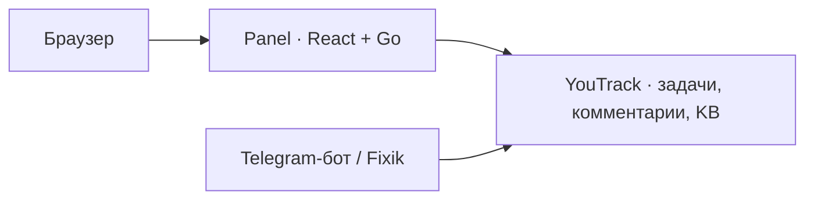

<div align="center">

# HomeLab Panel

**Задачи, обсуждения и база знаний — в одном веб-интерфейсе.**

React / Vite · Go · YouTrack · Светлая и тёмная темы

[Интерфейс](#интерфейс) · [Возможности](#возможности-и-честные-границы) · [Сборка](#сборка-и-проверки) · [Разработка](CONTRIBUTING.md)

</div>


Независимая веб-панель для работы с YouTrack. Telegram-бот для запуска,
входа и работы **не нужен**. Требования и актуальные решения:
[HL-210](https://youtrack.h1-cloud.ru/issue/HL-210) ·
[ADR-MW-001](https://youtrack.h1-cloud.ru/articles/HL-A-592).

> Изображения показывают UI из `535ecc1` на синтетических данных проекта `DEMO`.
> Обложка — композиция реальных локальных скриншотов. Это preview интерфейса,
> а не подтверждение production-развёртывания или полноты HL-210.

## Интерфейс

<table>
  <tr>
    <th width="50%">Задачи проекта</th>
    <th width="50%">Задача и обсуждение</th>
  </tr>
  <tr>
    <td valign="top"><a href="docs/images/issues-desktop.png"></a></td>
    <td valign="top"><a href="docs/images/issue-desktop.png"></a></td>
  </tr>
  <tr>
    <td>Список, время чтения и переход в точную задачу.</td>
    <td>Описание, поля YouTrack и адресное обсуждение.</td>
  </tr>
</table>

<details>
<summary><strong>Ещё экраны: вход и мобильная тёмная тема</strong></summary>

### Экран входа


### База знаний на телефоне

<p align="center">
  <a href="docs/images/knowledge-mobile-dark.png"></a>
</p>

</details>

Скриншоты можно открыть в полном размере. Способ пересъёмки и границы
демонстрационных данных описаны в [docs/preview](docs/preview/README.md).

## Как устроено



Нет вызовов Controller, Unix-сокетов, callbacks, общей БД, volumes, очереди
или bot token. Остановка одного приложения не требует остановки другого.
Общая зависимость — YouTrack: его отказ отключает получение/запись данных,
но не запуск Panel и не выдаётся за отказ бота.

Правила разработки: [AGENTS.md](AGENTS.md), [CONTRIBUTING.md](CONTRIBUTING.md).

## Возможности и честные границы

- Список/детали issues проекта, поля YouTrack, страницы комментариев.
- Чтение статей Knowledge Base проекта.
- Запись комментария в точный issue при включённом `PANEL_WRITES_ENABLED`.
- Создание/редактирование задач и статей — по ссылкам в штатный YouTrack.
- Нет прямых cancel/resume/worker health/Controller commands. Комментарий
  **не означает** admission, выполнение, остановку или изменение Task Revision.
  Автоматический разбор новых issues/comments ботом этим срезом не реализован.
- Обновление по запросу пользователя с временем чтения; не live stream.
  Markdown показывается безопасным текстом, без выполнения HTML.
- Черновики адресованы точному issue и сохраняются в памяти при переключении
  задач/разделов; reload/logout не сохраняет черновики.

Полный продуктовый R1–R3 остаётся HL-210. Изоляция не объявляется полным релизом
старого Mobile Workspace и не доказывает production/device acceptance.

## Независимый вход

Текущий вход — **персональный API-токен YouTrack**, не пароль и не токен бота.
Backend проверяет `/api/users/me` и точный allowlisted `PANEL_OWNER_LOGIN`;
все последующие обращения выполняются от этого пользователя с его правами.
Не передавайте токен агенту, не кладите его в env, Git, URL или web storage.
Вводить его можно только на проверенном dedicated HTTPS origin Panel.
Используйте минимально необходимые права проекта; не административный токен.

YouTrack credential остаётся только в памяти backend-сессии. Браузер получает
opaque `__Host-panel_session` cookie (Secure, HttpOnly, SameSite=Strict) и CSRF
в памяти. Idle TTL 30 минут, абсолютный TTL 8 часов, максимум 4 сессии.
Restart/logout инвалидируют сессии. OAuth/SSO и password login здесь не реализованы.

Внешний proxy должен запрещать body/header logging для login/API, сохранять
точный Host и предоставлять TLS. Backend не пишет HTTP request bodies/headers,
токены, комментарии или upstream errors в журнал.

## API и запись

Текущий контракт: [api/youtrack-panel.openapi.json](api/youtrack-panel.openapi.json),
public prefix `/api/v2`. Единственный upstream — operator-configured HTTPS
YouTrack origin. Redirects/proxy env отключены; timeout/response/page limits,
строгий lossless JSON и проверки проекта/ID обязательны.

Перед записью UI получает session-bound одноразовый permit на точный issue.
Permit потребляется атомарно **до** outbound POST. Повтор/истёкший permit/restart
не инициируют второй POST. Это не durable idempotency или очередь: при потерянном
ответе результат `write_outcome_unknown`, автоматического повторения нет.
Сначала проверить комментарии в YouTrack, затем решать о новой отправке.
Даже успешный ответ означает только запись в YouTrack, не приём агентом.
Проверка проекта перед POST не является транзакционной блокировкой переноса issue
в другой проект; окончательную авторизацию каждой операции выполняет YouTrack.

## Сборка и проверки

Go 1.26.5 / Node 24.18.0, зависимости и build images закреплены.

```sh
make quality
make image VERSION=local IMAGE=homelab-telegram-panel:local
bash scripts/test-container.sh homelab-telegram-panel:local
docker compose --env-file .env.example config --quiet
```

Quality: format/vet/race, frontend lint/types/tests, byte-for-byte embedded build
и standalone binary. Container smoke действительно запускает приложение без
бота и доступного YouTrack, проверяет health=200, data API=401, отсутствие mounts.
Это synthetic/local evidence, не live user acceptance.

## Контейнер

[compose.yaml](compose.yaml): собственный bridge, фиксированный non-root UID,
read-only filesystem, capabilities=none, resource limits, **без mounts**.
Host port опубликован только на 127.0.0.1; внешний TLS ingress не создаётся.
Указывать существующий image digest и проверенные НЕСЕКРЕТНЫЕ параметры из
[.env.example](.env.example). В шаблоне запись выключена.

Можно размещать отдельно от бота. Host networking, peer-UID и socket directory
больше не нужны. Bridge сам по себе не является egress firewall: перед deploy
проверить маршрут/TLS к точному YouTrack, host allowlist egress, proxy logging,
права пользователя, UI login/read/comment, мониторинг и rollback. Compose не
меняет существующую инфраструктуру и не выполняет этот preflight автоматически.

## Сохранённая предыдущая реализация

Extraction base: Fixik `next/@aea6ae7`; repository base этой миграции `d6121bd`.
Старые gateway/auth/private-client пакеты, UI `components/mobile-workspace.tsx`,
SDK source и OpenAPI v1 оставлены для сверки паритета и возврата, не удалены.
Они **не импортируются** новым executable/UI, SDK не поставляется в bundle.
Это проверяется `internal/architecture/boundaries_test.go`.
Историческое имя binary/command сохранено для build tooling; это не runtime связь.

Нельзя случайно вернуть старый entrypoint или включить legacy config.
Source cleanup и новый бот-side YouTrack command protocol — отдельный scope
HL-210/HL-214. Соседний Fixik checkout и текущий production не изменяются.
