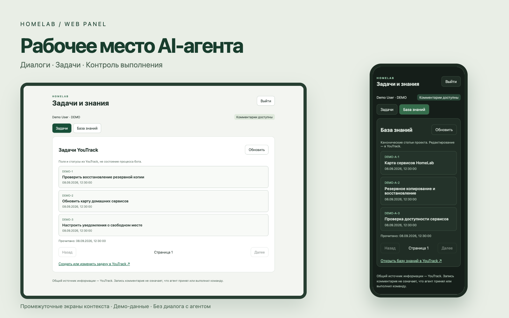
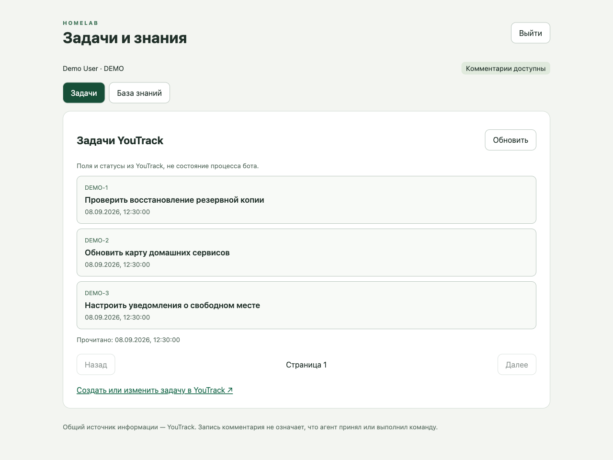
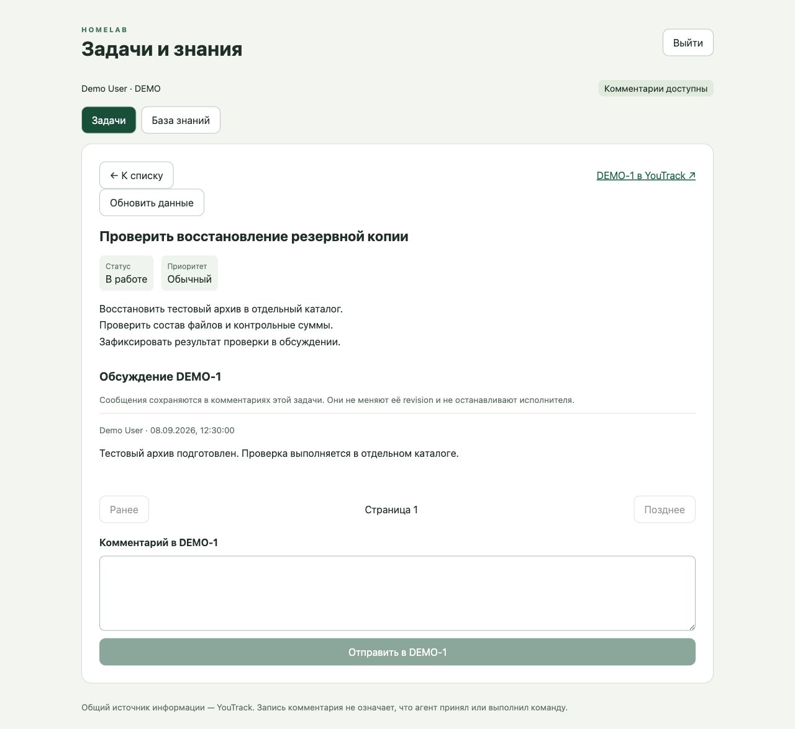
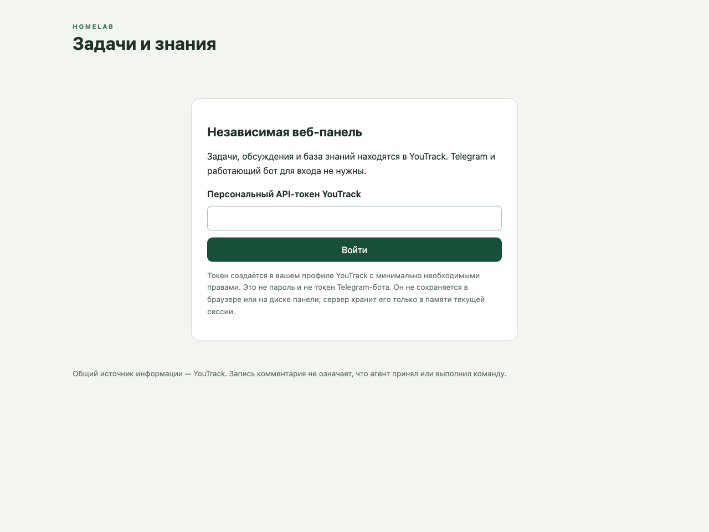
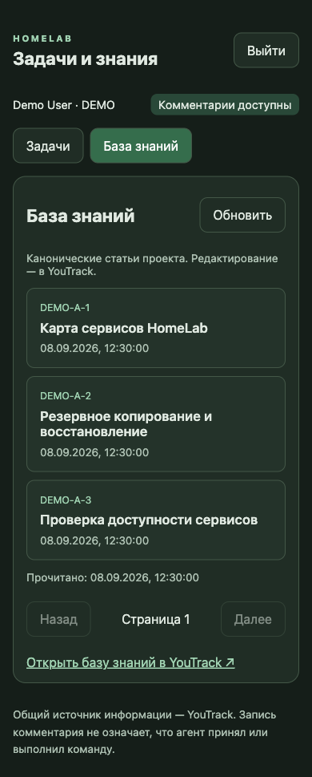
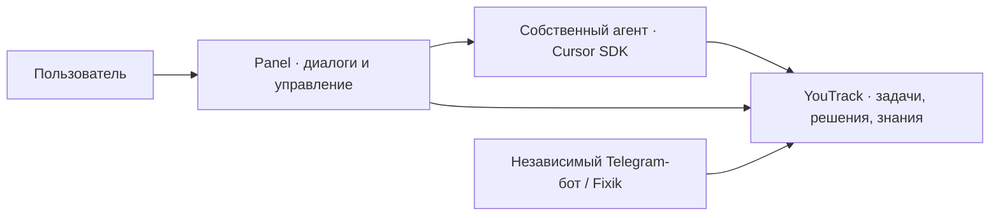

<div align="center">

# HomeLab Panel

**Веб-оболочка AI-агента: диалоги, задачи и контроль выполнения.**

Cursor SDK · Диалоги · Задачи · Контроль

[Интерфейс](#интерфейс) · [Назначение](#назначение) · [Статус реализации](#статус-реализации) · [Сборка](#сборка-и-проверки) · [Разработка](CONTRIBUTING.md)

</div>



HomeLab Panel — рабочее место для взаимодействия с собственным AI-агентом
на **Cursor SDK**. Пользователь общается с агентом, ставит задачи, следит за
их выполнением, отвечает на вопросы и управляет конкретной работой.
YouTrack хранит постановки, решения, знания и опубликованные результаты,
которые агент использует в работе.

## Назначение

Приложение создаётся как оболочка вокруг агента. Основные сценарии продукта:

- **Общаться:** вести диалоги с агентом и переключаться между независимыми контекстами.
- **Поручать работу:** задавать цель и уточнять её в контексте конкретной задачи.
- **Следить за выполнением:** видеть состояние, результат, причину ожидания и следующий шаг.
- **Управлять:** отвечать на вопросы агента, уточнять и адресно останавливать работу.
- **Сохранять контекст:** использовать задачи и базу знаний YouTrack, явно публиковать результаты.

Это назначение и целевые сценарии продукта; статус их реализации приведён ниже.
По принятой архитектуре Panel должна содержать собственный агентский runtime
и работать независимо от Telegram-бота.
Выход из веб-панели по требованиям продукта отзывает веб-доступ, но не останавливает
запущенного агента. Остановка работы — отдельное явное действие.

Канонические требования: [HL-210@10](https://youtrack.h1-cloud.ru/issue/HL-210).
Первый инкремент собственного агента: [HL-238@3](https://youtrack.h1-cloud.ru/issue/HL-238).

> Галерея показывает промежуточные экраны задач и знаний из `535ecc1`
> на синтетических данных `DEMO`. Диалог с агентом на этих снимках ещё отсутствует.
> Обложка — композиция локальных скриншотов; она не подтверждает полноту продукта
> или production-развёртывание.

## Интерфейс

<table>
  <tr>
    <th width="50%">Задачи проекта</th>
    <th width="50%">Задача и обсуждение</th>
  </tr>
  <tr>
    <td valign="top"><a href="docs/images/issues-desktop.png"></a></td>
    <td valign="top"><a href="docs/images/issue-desktop.png"></a></td>
  </tr>
  <tr>
    <td>Список, время чтения и переход в точную задачу.</td>
    <td>Описание, поля YouTrack и адресное обсуждение.</td>
  </tr>
</table>

<details>
<summary><strong>Ещё экраны: вход и мобильная тёмная тема</strong></summary>

### Экран входа



### База знаний на телефоне

<p align="center">
  <a href="docs/images/knowledge-mobile-dark.png"></a>
</p>

</details>

Скриншоты можно открыть в полном размере. Способ пересъёмки и границы
демонстрационных данных описаны в [docs/preview](docs/preview/README.md).

## Как устроено

Принятая продуктовая граница по HL-210@8–10:



Cursor SDK выполняет работу агента; Panel предоставляет интерфейс и управление
его запуском. YouTrack — канонический контекст задач и знаний, а также канал обмена
с независимым Telegram-ботом. Прямых вызовов Controller бота, общих БД, сокетов,
очередей и секретов между приложениями нет.

Правила разработки: [AGENTS.md](AGENTS.md), [CONTRIBUTING.md](CONTRIBUTING.md).

## Статус реализации

**В `main` на базе `df28c48` находится промежуточный срез интеграции с YouTrack.**
Он обеспечивает доступ к контексту для будущей работы агента:

- Список/детали issues проекта, поля YouTrack, страницы комментариев.
- Чтение статей Knowledge Base проекта.
- Запись комментария в точный issue при включённом `PANEL_WRITES_ENABLED`.
- Создание/редактирование задач и статей — по ссылкам в штатный YouTrack.
- Нет прямых cancel/resume/worker health/Controller commands. Комментарий
  **не означает** admission, выполнение, остановку или изменение Task Revision.
  Автоматический разбор новых issues/comments ботом этим срезом не реализован.
- Обновление по запросу пользователя с временем чтения; не live stream.
  Markdown показывается безопасным текстом, без выполнения HTML.
- Черновики адресованы точному issue и сохраняются в памяти при переключении
  задач/разделов; reload/logout не сохраняет черновики.

**Собственный агент развивается в HL-238**, отдельно от этого среза `main`:
диалог по выбранной задаче, Cursor SDK, чтение задач/комментариев/KB через инструменты,
состояния запуска, адресная остановка и явная публикация результата.
Это первый агентский инкремент; долговечная история нескольких диалогов,
полный жизненный цикл задач и production-приёмка остаются в HL-210.
Доступ к YouTrack сам по себе не означает готовность агентской оболочки.

Следующие технические разделы описывают именно текущий срез `main` без
агентского runtime. Конфигурация SDK и его проверки поставляются вместе с HL-238.

## Независимый вход

Текущий вход — **персональный API-токен YouTrack**, не пароль и не токен бота.
Backend проверяет `/api/users/me` и точный allowlisted `PANEL_OWNER_LOGIN`;
все последующие обращения выполняются от этого пользователя с его правами.
Не передавайте токен агенту, не кладите его в env, Git, URL или web storage.
Вводить его можно только на проверенном dedicated HTTPS origin Panel.
Используйте минимально необходимые права проекта; не административный токен.

YouTrack credential остаётся только в памяти backend-сессии. Браузер получает
opaque `__Host-panel_session` cookie (Secure, HttpOnly, SameSite=Strict) и CSRF
в памяти. Idle TTL 30 минут, абсолютный TTL 8 часов, максимум 4 сессии.
Restart/logout инвалидируют сессии. OAuth/SSO и password login здесь не реализованы.

Внешний proxy должен запрещать body/header logging для login/API, сохранять
точный Host и предоставлять TLS. Backend не пишет HTTP request bodies/headers,
токены, комментарии или upstream errors в журнал.

## API и запись

Текущий контракт: [api/youtrack-panel.openapi.json](api/youtrack-panel.openapi.json),
public prefix `/api/v2`. Единственный upstream — operator-configured HTTPS
YouTrack origin. Redirects/proxy env отключены; timeout/response/page limits,
строгий lossless JSON и проверки проекта/ID обязательны.

Перед записью UI получает session-bound одноразовый permit на точный issue.
Permit потребляется атомарно **до** outbound POST. Повтор/истёкший permit/restart
не инициируют второй POST. Это не durable idempotency или очередь: при потерянном
ответе результат `write_outcome_unknown`, автоматического повторения нет.
Сначала проверить комментарии в YouTrack, затем решать о новой отправке.
Даже успешный ответ означает только запись в YouTrack, не приём агентом.
Проверка проекта перед POST не является транзакционной блокировкой переноса issue
в другой проект; окончательную авторизацию каждой операции выполняет YouTrack.

## Сборка и проверки

Go 1.26.5 / Node 24.18.0, зависимости и build images закреплены.

```sh
make quality
make image VERSION=local IMAGE=homelab-telegram-panel:local
bash scripts/test-container.sh homelab-telegram-panel:local
docker compose --env-file .env.example config --quiet
```

Quality: format/vet/race, frontend lint/types/tests, byte-for-byte embedded build
и standalone binary. Container smoke действительно запускает приложение без
бота и доступного YouTrack, проверяет health=200, data API=401, отсутствие mounts.
Это synthetic/local evidence, не live user acceptance.

## Контейнер

[compose.yaml](compose.yaml): собственный bridge, фиксированный non-root UID,
read-only filesystem, capabilities=none, resource limits, **без mounts**.
Host port опубликован только на 127.0.0.1; внешний TLS ingress не создаётся.
Указывать существующий image digest и проверенные НЕСЕКРЕТНЫЕ параметры из
[.env.example](.env.example). В шаблоне запись выключена.

Можно размещать отдельно от бота. Host networking, peer-UID и socket directory
больше не нужны. Bridge сам по себе не является egress firewall: перед deploy
проверить маршрут/TLS к точному YouTrack, host allowlist egress, proxy logging,
права пользователя, UI login/read/comment, мониторинг и rollback. Compose не
меняет существующую инфраструктуру и не выполняет этот preflight автоматически.

## Сохранённая предыдущая реализация

Extraction base: Fixik `next/@aea6ae7`; repository base этой миграции `d6121bd`.
Старые gateway/auth/private-client пакеты, UI `components/mobile-workspace.tsx`,
Telegram SDK source и OpenAPI v1 оставлены для сверки паритета и возврата, не удалены.
Они **не импортируются** новым executable/UI, Telegram SDK не поставляется в bundle.
Это проверяется `internal/architecture/boundaries_test.go`.
Историческое имя binary/command сохранено для build tooling; это не runtime связь.

Нельзя случайно вернуть старый entrypoint или включить legacy config.
Source cleanup и новый бот-side YouTrack command protocol — отдельный scope
HL-210/HL-214. Соседний Fixik checkout и текущий production не изменяются.
